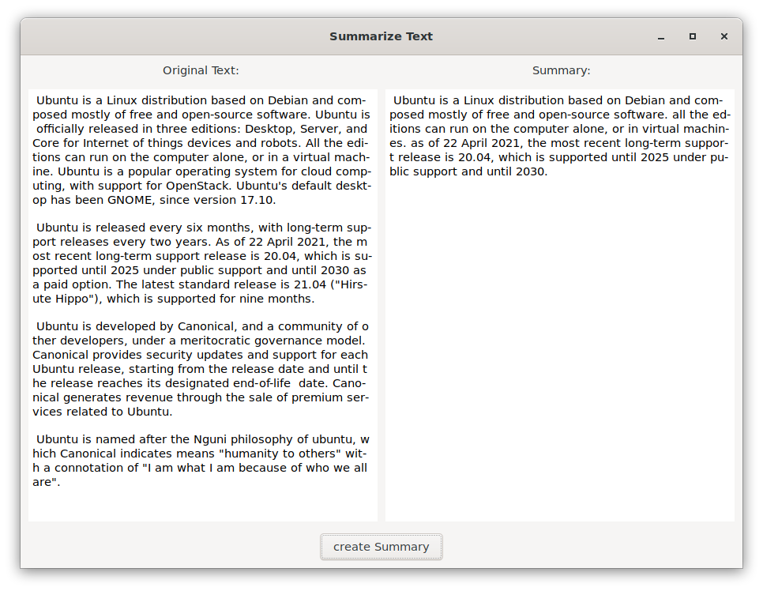

# Text-Summarizer
A GTK-3 app using Googles T5 model to create a summary of a user specified text. This is just a little project to learn a bit about development with GTK-3. 

Due to file soz elimitations the actual model is not included. The files can be obtained at [https://huggingface.co/t5-small](https://huggingface.co/t5-small). Copy the following files into a sub directory "model" in the data folder of the project: config.json, gitattributes, pytorch_model.bin, README.md, spiece.model, tokenizer.json.
